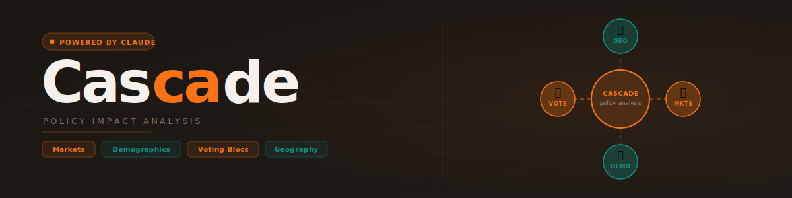

<p align="center">
  
</p>

<p align="center">
  <a href="LICENSE"></a>
  
  
  
  <a href="https://github.com/ada-rr2725/anthropic-hackathon-sandbox/actions/workflows/lint.yml"></a>
</p>

<br/>

> **Built at the Claude Hackathon @ Imperial College London.**

Web link:
[https://cascade-xi.vercel.app/](https://cascade-xi.vercel.app/)
---

<!-- demo GIF — record with: ANTHROPIC_API_KEY=sk-ant-... node scripts/record-demo.js -->


## Features

- **Plain-English input** — describe any policy without structured forms or dropdowns
- **Streaming analysis** — the UI updates live as Claude reasons through the policy
- **Four analysis dimensions:**
  - **Markets** — impact scores across all 11 S&P 500 sectors with direction, magnitude, and confidence
  - **People** — effects on 15 demographic groups by income, age, geography, and occupation
  - **Voters** — electoral alignment for 10 voting blocs with significance ratings
  - **Geography** — interactive world map showing which countries are affected and why
- **Timeline** — immediate, short-term, medium-term, and long-term projections
- **Historical analogues** — comparable past policies for context
- **No backend required** — runs entirely in the browser against the Anthropic API

## Tech stack

| Layer | Technology |
|---|---|
| UI | React 19 + Vite 8 |
| Styling | Tailwind CSS v4 |
| Charts | Plotly.js 2.27 (CDN) |
| Maps | D3.js 7.9 + TopoJSON 3 (CDN) |
| LLM | Anthropic Claude Haiku (direct browser API) |
| Fonts | DM Sans + DM Mono |

## Getting started

### Prerequisites

- Node.js 18+
- An [Anthropic API key](https://console.anthropic.com/)

### Installation

```bash
git clone https://github.com/ada-rr2725/anthropic-hackathon-sandbox.git
cd anthropic-hackathon-sandbox
npm install
```

### Configuration

```bash
cp .env.example .env
```

Open `.env` and set your API key:

```
VITE_ANTHROPIC_API_KEY=sk-ant-...
```

### Run

```bash
npm run dev
```

Open [http://localhost:5173](http://localhost:5173) and try a prompt like:

> *"The UK raises the national minimum wage to £15 per hour"*

## How it works

```
User prompt
    │
    ▼
Anthropic API (claude-haiku-4-5, streaming)
    │
    ▼
JSON parser  ──── fallback bracket-matching on parse failure
    │
    ▼
App.jsx distributes parsed analysis to chart components
    │
    ├── MarketsChart   (Plotly horizontal bars)
    ├── PeopleChart    (Plotly grouped bars)
    ├── VotersChart    (Plotly lollipop chart)
    ├── WorldMap       (D3 + TopoJSON choropleth)
    └── TimelineView   (four-horizon text layout)
```

The system prompt in `src/prompts/understanding.js` enforces a strict JSON output schema — Claude is instructed to return only valid JSON with no markdown or preamble, scored across every dimension listed above.

See [`docs/spec.md`](docs/spec.md) for the full product specification.

## Project structure

```
src/
├── App.jsx                  # Root component and application state
├── components/
│   ├── BackgroundMap.jsx    # Animated world map backdrop (D3)
│   ├── CascadeGraph.jsx     # Radial analysis-progress diagram
│   ├── MarketsChart.jsx     # S&P sector impact bars (Plotly)
│   ├── PeopleChart.jsx      # Demographic impact breakdown (Plotly)
│   ├── VotersChart.jsx      # Voting bloc alignment chart (Plotly)
│   ├── TimelineView.jsx     # Four-horizon timeline
│   └── WorldMap.jsx         # Interactive geographic impact map (D3)
├── services/
│   ├── anthropic.js         # Streaming SSE client
│   ├── modelParser.js       # Safe JSON extraction from LLM output
│   └── codeExecutor.js      # Sandboxed code runner
└── prompts/
    └── understanding.js     # Policy analysis system prompt + JSON schema
```

## Development

```bash
npm run dev      # start dev server with HMR
npm run build    # production build
npm run preview  # preview production build locally
npm run lint     # run ESLint
```

### Recording the demo GIF

A Playwright script in `scripts/record-demo.js` automates the full demo walkthrough and saves a `.webm` video.

```bash
# one-time setup
npm install --save-dev playwright
npx playwright install chromium

# record (make sure npm run dev is running first)
ANTHROPIC_API_KEY=sk-ant-... node scripts/record-demo.js
```

Convert the output to GIF via [ezgif.com](https://ezgif.com/video-to-gif) or ffmpeg, then save to `docs/demo.gif` and uncomment the image tag near the top of this README.

## Licence

[MIT](LICENSE) — Robin Rai, Emircan Karaca, Kevin Wadhwa & Jia Zheng Ong, 2026